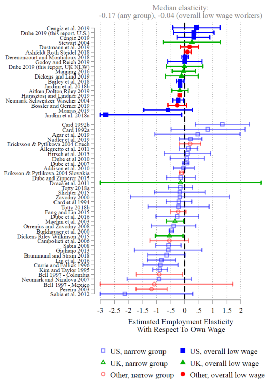
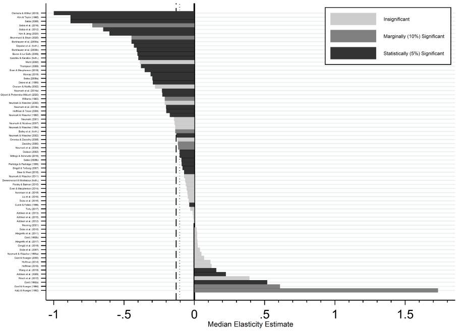

```{r Setup, include = F}
options(htmltools.dir.version = FALSE)
library(pacman)
p_load(ggthemes, readxl, viridis, knitr, ggdag, gapminder, extrafont, tidyverse, magrittr, janitor, kableExtra)
# Define colors
red_pink <- "#e64173"
met_slate <- "#272822" # metropolis font color 
purple <- "#9370DB"
green <- "#007935"
light_green <- "#7DBA97"
orange <- "#FD5F00"
turquoise <- "#44C1C4"
# Knitr options
opts_chunk$set(
  comment = "#>",
  fig.align = "center",
  fig.height = 7,
  fig.width = 10.5,
  #dpi = 300,
  #cache = T,
  warning = F,
  message = F
)  
theme_simple <- theme_bw() + theme(
  axis.line = element_line(color = met_slate),
  panel.grid = element_blank(),
  rect = element_blank(),
  strip.text = element_blank(),
  text = element_text(family = "Fira Sans", color = met_slate, size = 17),
  axis.text.x = element_text(size = 12),
  axis.text.y = element_text(size = 12),
  axis.ticks = element_blank()
)
theme_market <- theme_bw() + theme(
  axis.line = element_line(color = met_slate),
  panel.grid = element_blank(),
  rect = element_blank(),
  strip.text = element_blank(),
  text = element_text(family = "Fira Sans", color = met_slate, size = 17),
  axis.title.x = element_text(hjust = 1, size = 17),
  axis.title.y = element_text(hjust = 1, angle = 0, size = 17),
  # axis.text.x = element_text(size = 12),
  # axis.text.y = element_text(size = 12),
  axis.ticks = element_blank()
)
theme_gif <- theme_bw() + theme(
  axis.line = element_line(color = met_slate),
  panel.grid = element_blank(),
  rect = element_blank(),
  text = element_text(family = "Fira Sans", color = met_slate, size = 17),
  axis.text.x = element_text(size = 12),
  axis.text.y = element_text(size = 12),
  axis.ticks = element_blank()
)

xaringanExtra::use_scribble()
```

# Azar et al. (2020)

## **Discussion**

**Q.sub[1]:** What are the strengths of the study?

**Q.sub[2]:** What are the weaknesses of the study?

**Q.sub[3]:** What can we learn from the study?

---
# Azar et al. (2020)

The authors worry about unobserved changes in productivity within markets, so they use an **instrumental variables strategy**.

- An **instrumental variable** has a direct effect on the intensity of treatment, but has no direct effect on the outcome variable. It can be used to **isolate** the **"clean" variation in treatment**.


--

.pull-left[
```{r, dev = "svg", echo = F, fig.width = 5.5, fig.height = 3.5}
set.seed(1230)
iv <-
  dagify(Y ~ D + U,
         D ~ U + Z,
         exposure = "D",
         outcome = "Y") %>%
  ggplot(aes(
    x = x,
    y = y,
    xend = xend,
    yend = yend
  )) +
  geom_dag_point(color = red_pink) +
  geom_dag_edges_link(arrow = grid::arrow(length = grid::unit(10, "pt"), type = "closed")) +
  geom_dag_text(family = "Fira Sans", size = 10) +
  theme_dag()
iv
```
]
.pull-right[
**Variables**
- .hi[D] .mono[=] Local market concentration
- .hi[Y] .mono[=] Local wages
- .hi[Z] .mono[=] Instrument (concentration in other markets)
- .hi[U] .mono[=] Unobserved changes *within* each market

]

---
# Azar et al. (2020)

## **Instrumental variables**

The instrument (concentration in other markets) is valid if it only affects local wages through local market concentration. If there is a direct effect on local wages, then it is invalid.

.pull-left[
.center[**Valid instrument**]
```{r, dev = "svg", echo = F, fig.width = 5.5, fig.height = 3.25}
iv
```
]
.pull-right[
.center[**Invalid instrument**]
```{r, dev = "svg", echo = F, fig.width = 5.5, fig.height = 3.25}
set.seed(1229)
dagify(Y ~ D + U + Z,
       D ~ U + Z,
       exposure = "D",
       outcome = "Y") %>% 
  ggplot(aes(
    x = x,
    y = y,
    xend = xend,
    yend = yend
  )) +
  geom_dag_point(color = red_pink) +
  geom_dag_edges_link(arrow = grid::arrow(length = grid::unit(10, "pt"), type = "closed")) +
  geom_dag_text(family = "Fira Sans", size = 10) +
  theme_dag()
```
]

---
class: inverse, middle

# Minimum wages

---
# Minimum wages

.bigger[**Policy Q:** Should the federal government increase the minimum wage to $15?]

--

**Research Q:** How would a $15 minimum wage affect workers and employers?

- **Q:** Would a higher minimum wage help low-wage workers? Would it reduce poverty?
- **Q:** What are the tradeoffs of a higher minimum wage?
- **Q:** Are there are any unintended consequences that we should be aware of?


--

A great deal of economic research focuses on **how minimum wages affect employment**.

- **Why?** Disemployment is one of the main (potential) unintended consequences. You only enjoy the benefits of a wage increase if you keep your job!

---
# Minimum wages

.pull-left[
```{r, echo = FALSE, fig.height = 5.5, fig.width = 5.5, dev = "svg"}
x <- 0:10
demand <- function(x) 10 - x
supply <- function(x) 1 + x

q_1 <- uniroot(function(x) demand(x) - supply(x), range(x))$root
p_1 <- demand(q_1)
min_wage <- p_1 - 2 

ggplot(data = data.frame(x = 0), mapping = aes(x = x)) +
  scale_x_continuous(limits = c(0, 10.5), expand = c(0, 0), breaks = c(q_1), labels = c(expression(E[1]))) +
  scale_y_continuous(limits = c(0, 10.5), expand = c(0, 0), breaks = c(min_wage, p_1), labels = c(expression(underline(w)), expression(w[1]))) +
  theme_market +
  labs(x = "E", y = "w") +
  stat_function(fun = demand, color = purple, size = 1) +
  stat_function(fun = supply, color = red_pink, size = 1) +
  geom_point(x = q_1, y = p_1, color = met_slate, size = 2) +
  geom_segment(x = 0, xend = q_1, y = p_1, yend = p_1, color = met_slate, linetype = "dashed") +
  geom_segment(x = q_1, xend = q_1, y = 0, yend = p_1, color = met_slate, linetype = "dashed") +
  geom_hline(yintercept = min_wage, size = 1, color = met_slate) +
  annotate("label", label = expression(S), x = 8, y = supply(8), color = red_pink, family = "Fira Sans", size = 5) +
  annotate("label", label = expression(D), x = 9, y = demand(9), color = purple, family = "Fira Sans", size = 5)
```
]
.pull-right[
## **Theory**

**Q:** How does a minimum wage **set below** the current equilibrium wage affect employment?
]

---
count: false
# Minimum wages

.pull-left[
```{r, echo = FALSE, fig.height = 5.5, fig.width = 5.5, dev = "svg"}
ggplot(data = data.frame(x = 0), mapping = aes(x = x)) +
  scale_x_continuous(limits = c(0, 10.5), expand = c(0, 0), breaks = c(q_1), labels = c(expression(E[1]==E[2]))) +
  scale_y_continuous(limits = c(0, 10.5), expand = c(0, 0), breaks = c(min_wage, p_1), labels = c(expression(underline(w)), expression(w[1]))) +
  theme_market +
  labs(x = "E", y = "w") +
  stat_function(fun = demand, color = purple, size = 1) +
  stat_function(fun = supply, color = red_pink, size = 1) +
  geom_point(x = q_1, y = p_1, color = met_slate, size = 2) +
  geom_segment(x = 0, xend = q_1, y = p_1, yend = p_1, color = met_slate, linetype = "dashed") +
  geom_segment(x = q_1, xend = q_1, y = 0, yend = p_1, color = met_slate, linetype = "dashed") +
  geom_hline(yintercept = min_wage, size = 1, color = met_slate) +
  annotate("label", label = expression(S), x = 8, y = supply(8), color = red_pink, family = "Fira Sans", size = 5) +
  annotate("label", label = expression(D), x = 9, y = demand(9), color = purple, family = "Fira Sans", size = 5)
```
]
.pull-right[
## **Theory**

**Q:** How does a minimum wage **set below** the current equilibrium wage affect employment?

**A:** It doesn't. The current equilibrium wage **already satisfies** the minimum-wage requirement. No adjustments required!

- At the same time, this minimum wage doesn't "do anything" for workers&mdash;no different than not having a minimum wage!
- This is known as a **non-binding** minimum wage.
]

---
# Minimum wages

.pull-left[
```{r, echo = FALSE, fig.height = 5.5, fig.width = 5.5, dev = "svg"}
x <- 0:10
demand <- function(x) 10 - x
supply <- function(x) 1 + x

q_1 <- uniroot(function(x) demand(x) - supply(x), range(x))$root
p_1 <- demand(q_1)
min_wage <- p_1 + 2 
q_2 <- uniroot(function(x) demand(x) - min_wage, range(x))$root


ggplot(data = data.frame(x = 0), mapping = aes(x = x)) +
  scale_x_continuous(limits = c(0, 10.5), expand = c(0, 0), breaks = c(q_1), labels = c(expression(E[1]))) +
  scale_y_continuous(limits = c(0, 10.5), expand = c(0, 0), breaks = c(p_1, min_wage), labels = c(expression(w[1]), expression(underline(w)))) +
  theme_market +
  labs(x = "E", y = "w") +
  stat_function(fun = demand, color = purple, size = 1) +
  stat_function(fun = supply, color = red_pink, size = 1) +
  geom_point(x = q_1, y = p_1, color = met_slate, size = 2) +
  geom_segment(x = 0, xend = q_1, y = p_1, yend = p_1, color = met_slate, linetype = "dashed") +
  geom_segment(x = q_1, xend = q_1, y = 0, yend = p_1, color = met_slate, linetype = "dashed") +
  geom_hline(yintercept = min_wage, size = 1, color = met_slate) +
  annotate("label", label = expression(S), x = 8, y = supply(8), color = red_pink, family = "Fira Sans", size = 5) +
  annotate("label", label = expression(D), x = 9, y = demand(9), color = purple, family = "Fira Sans", size = 5)
```
]
.pull-right[
## **Theory**

**Q:** How does a minimum wage **set above** the current equilibrium wage affect employment?
]

---
count: false
# Minimum wages

.pull-left[
```{r, echo = FALSE, fig.height = 5.5, fig.width = 5.5, dev = "svg"}
ggplot(data = data.frame(x = 0), mapping = aes(x = x)) +
  scale_x_continuous(limits = c(0, 10.5), expand = c(0, 0), breaks = c(q_2, q_1), labels = c(expression(E[2]), expression(E[1]))) +
  scale_y_continuous(limits = c(0, 10.5), expand = c(0, 0), breaks = c(p_1, min_wage), labels = c(expression(w[1]), expression(underline(w)))) +
  theme_market +
  labs(x = "E", y = "w") +
  stat_function(fun = demand, color = purple, size = 1) +
  stat_function(fun = supply, color = red_pink, size = 1) +
  geom_point(x = q_1, y = p_1, color = met_slate, size = 2) +
  geom_point(x = q_2, y = min_wage, color = met_slate, size = 2) +
  geom_segment(x = 0, xend = q_1, y = p_1, yend = p_1, color = met_slate, linetype = "dashed") +
  geom_segment(x = q_1, xend = q_1, y = 0, yend = p_1, color = met_slate, linetype = "dashed") +
  geom_segment(x = q_2, xend = q_2, y = 0, yend = min_wage, color = met_slate, linetype = "dashed") +
  geom_hline(yintercept = min_wage, size = 1, color = met_slate) +
  annotate("label", label = expression(S), x = 8, y = supply(8), color = red_pink, family = "Fira Sans", size = 5) +
  annotate("label", label = expression(D), x = 9, y = demand(9), color = purple, family = "Fira Sans", size = 5)
```
]
.pull-right[
## **Theory**

**Q:** How does a minimum wage **set above** the current equilibrium wage affect employment?

**A:** It reduces the number of employed workers.

- **"Winners and losers:"** Workers who keep their jobs earn a higher wage, but workers who lose their jobs end up losing their labor income.
- **Unemployment:** At the higher wage, the quantity of labor supplied exceeds the quantity demanded.
]

---
# Minimum wages

.pull-left[
## **Evidence**

There is considerable variation in estimates of the effect of minimum wages on employment!

Most studies use **difference-in-differences designs**, but differ on other margins:

- **Data** (*e.g.,* surveys *vs.* administrative data)
- **Sample** (*e.g.,* restaurant workers only, teens only, all low-wage workers, *etc.*)
- **Modeling** (*e.g.,* choice of control variables)
- **Increases considered** (*e.g.,* case studies, federal increases, state increases, *etc.*)

]
.pull-right[
```{r, fig.retina = 2.25, echo = FALSE}

```
.footnote[*Source:* Arindrajit Dube (2019), [Impacts of Minimum Wages: Review of the International Evidence](https://www.gov.uk/government/publications/impacts-of-minimum-wages-review-of-the-international-evidence), *Report prepared for Her Majesty's Treasury (UK)*.]
]

---
# Minimum wages

.pull-left[
## **Evidence**

There is considerable variation in estimates of the effect of minimum wages on employment!

Most studies use **difference-in-differences designs**, but differ on other margins.

.hi[There is even disagreement about how to summarize the empirical literature!]

]
.pull-right[
```{r, fig.retina = 2, echo = FALSE}

```

.footnote[*Source:* David Neumark and Peter Shirley (2021), [Myth or Measurement: What Does the New Minimum Wage Research Say About Minimum Wages and Job Loss in the United States?](https://www.nber.org/papers/w28388), *NBER Working Paper 28388*.]
]

---
# Minimum wages

## **What do we know so far?**

The traditional neoclassical model predicts **an unambiguous decrease** in employment!

Economists disagree about how minimum wages affect employment, but it does appear that some increases in the minimum wage increased employment.

--

This raises important questions!

- **Q:** Is the neoclassical model wrong? What is missing from our analysis?
- **Q:** How do employers respond to increases in the minimum wage? On what margins do they make adjustments?

---
# Margins of adjustment

.pull-left[
```{r, echo = FALSE, fig.height = 5.5, fig.width = 5.5, dev = "svg"}
x <- 0:10
demand <- function(x) 10 - x
demand_2 <- function(x) 11.5 - x

supply <- function(x) 1 + x

q_1 <- uniroot(function(x) demand(x) - supply(x), range(x))$root
p_1 <- demand(q_1)
min_wage <- p_1 + 2 
q_2 <- uniroot(function(x) demand_2(x) - min_wage, range(x))$root


ggplot(data = data.frame(x = 0), mapping = aes(x = x)) +
  scale_x_continuous(limits = c(0, 10.5), expand = c(0, 0), breaks = c(q_1), labels = c(expression(E[1]))) +
  scale_y_continuous(limits = c(0, 10.5), expand = c(0, 0), breaks = c(p_1, min_wage), labels = c(expression(w[1]), expression(underline(w)))) +
  theme_market +
  labs(x = "E", y = "w") +
  stat_function(fun = demand, color = purple, size = 1) +
  stat_function(fun = supply, color = red_pink, size = 1) +
  geom_point(x = q_1, y = p_1, color = met_slate, size = 2) +
  geom_segment(x = 0, xend = q_1, y = p_1, yend = p_1, color = met_slate, linetype = "dashed") +
  geom_segment(x = q_1, xend = q_1, y = 0, yend = p_1, color = met_slate, linetype = "dashed") +
  geom_hline(yintercept = min_wage, size = 1, color = met_slate) +
  annotate("label", label = expression(S), x = 8, y = supply(8), color = red_pink, family = "Fira Sans", size = 5) +
  annotate("label", label = expression(D[1]==MP[E]%*%~p[1]), x = 9 - 0.3, y = demand(9), color = purple, family = "Fira Sans", size = 5)
```
]
.pull-right[
## **Consumer prices**

Firms can respond to a binding minimum wage by **increasing the price** of the output good.

- This is known as **pass-through**, which can partially **offset** the effects of a wage increase.

]

---
count: false
# Margins of adjustment

.pull-left[
```{r, echo = FALSE, fig.height = 5.5, fig.width = 5.5, dev = "svg"}
ggplot(data = data.frame(x = 0), mapping = aes(x = x)) +
  scale_x_continuous(limits = c(0, 10.5), expand = c(0, 0), breaks = c(q_2, q_1), labels = c(expression(E[2]), expression(E[1]))) +
  scale_y_continuous(limits = c(0, 10.5), expand = c(0, 0), breaks = c(p_1, min_wage), labels = c(expression(w[1]), expression(underline(w)))) +
  theme_market +
  labs(x = "E", y = "w") +
  stat_function(fun = demand, color = purple, size = 1, alpha = 0.5) +
  stat_function(fun = demand_2, color = purple, size = 1) +
  stat_function(fun = supply, color = red_pink, size = 1) +
  geom_point(x = q_1, y = p_1, color = met_slate, size = 2) +
  geom_segment(x = 0, xend = q_1, y = p_1, yend = p_1, color = met_slate, linetype = "dashed") +
  geom_segment(x = q_1, xend = q_1, y = 0, yend = p_1, color = met_slate, linetype = "dashed") +
  geom_point(x = q_2, y = min_wage, color = met_slate, size = 2) +
  geom_segment(x = q_2, xend = q_2, y = 0, yend = min_wage, color = met_slate, linetype = "dashed") +
  geom_hline(yintercept = min_wage, size = 1, color = met_slate) +
  annotate("label", label = expression(S), x = 8, y = supply(8), color = red_pink, family = "Fira Sans", size = 5) +
  annotate("label", label = expression(D[1]==MP[E]%*%~p[1]), x = 9 - 0.3, y = demand(9), color = purple, family = "Fira Sans", size = 5) +
  annotate("label", label = expression(D[2]==MP[E]%*%~p[2]), x = 9 + 0.2, y = demand_2(9), color = purple, family = "Fira Sans", size = 5)
```
]
.pull-right[
## **Consumer prices**

Firms can respond to a binding minimum wage by **increasing the price** of the output good.

- This is known as **pass-through**, which can partially **offset** the effects of a wage increase.
- The ability of firms to increase prices depends on consumers' sensitivity to changes in price.

In this example, the **decrease in employment is smaller** than when prices are held constant, but unemployment remains.
 
]

---
# Margins of adjustment

.pull-left[
```{r, echo = FALSE, fig.height = 5.5, fig.width = 5.5, dev = "svg"}
x <- 0:10
demand <- function(x) 10 - x
demand_2 <- function(x) 12 - x

supply <- function(x) 1 + x
supply_2 <- function(x) 3 + x

q_1 <- uniroot(function(x) demand(x) - supply(x), range(x))$root
p_1 <- demand(q_1)
min_wage <- p_1 + 2 
q_2 <- uniroot(function(x) demand_2(x) - min_wage, range(x))$root


ggplot(data = data.frame(x = 0), mapping = aes(x = x)) +
  scale_x_continuous(limits = c(0, 10.5), expand = c(0, 0), breaks = c(q_1), labels = c(expression(E[1]))) +
  scale_y_continuous(limits = c(0, 10.5), expand = c(0, 0), breaks = c(p_1, min_wage), labels = c(expression(w[1]), expression(underline(w)))) +
  theme_market +
  labs(x = "E", y = "w") +
  stat_function(fun = demand, color = purple, size = 1) +
  stat_function(fun = supply, color = red_pink, size = 1) +
  geom_point(x = q_1, y = p_1, color = met_slate, size = 2) +
  geom_segment(x = 0, xend = q_1, y = p_1, yend = p_1, color = met_slate, linetype = "dashed") +
  geom_segment(x = q_1, xend = q_1, y = 0, yend = p_1, color = met_slate, linetype = "dashed") +
  geom_hline(yintercept = min_wage, size = 1, color = met_slate) +
  annotate("label", label = expression(S[1]), x = 8, y = supply(8), color = red_pink, family = "Fira Sans", size = 5) +
  annotate("label", label = expression(D[1]==VMP[E]-f[1]), x = 9 - 0.3, y = demand(9), color = purple, family = "Fira Sans", size = 5)
```
]
.pull-right[
## **Fringe benefits**

Firms can respond to a binding minimum wage by **cutting fringe benefits**.

- In addition to reducing supply, decreases in non-wage compensation also increase demand!.super[.hi-pink[<span>&#8224;</span>]]

.footnote[.super[.hi-pink[<span>&#8224;</span>]] Fringe benefits affect the marginal cost of hiring a worker, but our previous analysis of profit maximization implicitly assumed that firms do not provide non-wage compensation.]
]

---
count: false
# Margins of adjustment

.pull-left[
```{r, echo = FALSE, fig.height = 5.5, fig.width = 5.5, dev = "svg"}
ggplot(data = data.frame(x = 0), mapping = aes(x = x)) +
  scale_x_continuous(limits = c(0, 10.5), expand = c(0, 0), breaks = c(q_1), labels = c(expression(E[1]==E[2]))) +
  scale_y_continuous(limits = c(0, 10.5), expand = c(0, 0), breaks = c(p_1, min_wage), labels = c(expression(w[1]), expression(underline(w)))) +
  theme_market +
  labs(x = "E", y = "w") +
  stat_function(fun = demand, color = purple, size = 1, alpha = 0.5) +
  stat_function(fun = demand_2, color = purple, size = 1) +
  stat_function(fun = supply, color = red_pink, size = 1, alpha = 0.5) +
  stat_function(fun = supply_2, color = red_pink, size = 1) +
  geom_point(x = q_1, y = p_1, color = met_slate, size = 2) +
  geom_segment(x = 0, xend = q_1, y = p_1, yend = p_1, color = met_slate, linetype = "dashed") +
  geom_segment(x = q_1, xend = q_1, y = 0, yend = p_1, color = met_slate, linetype = "dashed") +
  geom_point(x = q_2, y = min_wage, color = met_slate, size = 2) +
  geom_segment(x = q_2, xend = q_2, y = p_1, yend = min_wage, color = met_slate, linetype = "dashed") +
  geom_hline(yintercept = min_wage, size = 1, color = met_slate) +
  annotate("label", label = expression(S[1]), x = 8, y = supply(8), color = red_pink, family = "Fira Sans", size = 5) +
  annotate("label", label = expression(S[2]), x = 6, y = supply_2(6), color = red_pink, family = "Fira Sans", size = 5) +
  annotate("label", label = expression(D[1]==VMP[E]-f[1]), x = 9 - 0.3, y = demand(9), color = purple, family = "Fira Sans", size = 5) +
  annotate("label", label = expression(D[2]==VMP[E]-f[2]), x = 9 + 0.1, y = demand_2(9), color = purple, family = "Fira Sans", size = 5)
```
]
.pull-right[
## **Fringe benefits**

Firms can respond to a binding minimum wage by **cutting fringe benefits**.

- In addition to reducing supply, decreases in non-wage compensation also increase demand!.super[.hi-pink[<span>&#8224;</span>]]

In this example, the decrease in fringe benefits **perfectly offsets** the wage increase.

- No unemployment!

.footnote[.super[.hi-pink[<span>&#8224;</span>]] Fringe benefits affect the marginal cost of hiring a worker, but our previous analysis of profit maximization implicitly assumed that firms do not provide non-wage compensation.]
]

---
# Margins of adjustment

.pull-left[
```{r, echo = FALSE, fig.height = 5.5, fig.width = 5.5, dev = "svg"}
x <- 0:10
demand <- function(x) 10 - x
demand_2 <- function(x) 11 - x

supply <- function(x) 1 + x
supply_2 <- function(x) 4 + x

q_1 <- uniroot(function(x) demand(x) - supply(x), range(x))$root
p_1 <- demand(q_1)
min_wage <- p_1 + 2 
q_2 <- uniroot(function(x) demand_2(x) - min_wage, range(x))$root


ggplot(data = data.frame(x = 0), mapping = aes(x = x)) +
  scale_x_continuous(limits = c(0, 10.5), expand = c(0, 0), breaks = c(q_1), labels = c(expression(E[1]))) +
  scale_y_continuous(limits = c(0, 10.5), expand = c(0, 0), breaks = c(p_1, min_wage), labels = c(expression(w[1]), expression(underline(w)))) +
  theme_market +
  labs(x = "E", y = "w") +
  stat_function(fun = demand, color = purple, size = 1) +
  stat_function(fun = supply, color = red_pink, size = 1) +
  geom_point(x = q_1, y = p_1, color = met_slate, size = 2) +
  geom_segment(x = 0, xend = q_1, y = p_1, yend = p_1, color = met_slate, linetype = "dashed") +
  geom_segment(x = q_1, xend = q_1, y = 0, yend = p_1, color = met_slate, linetype = "dashed") +
  geom_hline(yintercept = min_wage, size = 1, color = met_slate) +
  annotate("label", label = expression(S[1]), x = 8, y = supply(8), color = red_pink, family = "Fira Sans", size = 5) +
  annotate("label", label = expression(D[1]==MP[1]%*%~p), x = 9 - 0.7, y = demand(9), color = purple, family = "Fira Sans", size = 5)
```
]
.pull-right[
## **Effort requirements**

Firms can respond to a binding minimum wage by **making employees work harder**.

- Working conditions become less desirable, which decreases labor supply.
- Marginal product of labor increases, which increases labor demand
]

---
count: false
# Margins of adjustment

.pull-left[
```{r, echo = FALSE, fig.height = 5.5, fig.width = 5.5, dev = "svg"}
ggplot(data = data.frame(x = 0), mapping = aes(x = x)) +
  scale_x_continuous(limits = c(0, 10.5), expand = c(0, 0), breaks = c(q_2, q_1), labels = c(expression(E[2]), expression(E[1]))) +
  scale_y_continuous(limits = c(0, 10.5), expand = c(0, 0), breaks = c(p_1, min_wage), labels = c(expression(w[1]), expression(underline(w)))) +
  theme_market +
  labs(x = "E", y = "w") +
  stat_function(fun = demand, color = purple, size = 1, alpha = 0.5) +
  stat_function(fun = demand_2, color = purple, size = 1) +
  stat_function(fun = supply, color = red_pink, size = 1, alpha = 0.5) +
  stat_function(fun = supply_2, color = red_pink, size = 1) +
  geom_point(x = q_1, y = p_1, color = met_slate, size = 2) +
  geom_segment(x = 0, xend = q_1, y = p_1, yend = p_1, color = met_slate, linetype = "dashed") +
  geom_segment(x = q_1, xend = q_1, y = 0, yend = p_1, color = met_slate, linetype = "dashed") +
  geom_point(x = q_2, y = min_wage, color = met_slate, size = 2) +
  geom_segment(x = q_2, xend = q_2, y = 0, yend = min_wage, color = met_slate, linetype = "dashed") +
  geom_hline(yintercept = min_wage, size = 1, color = met_slate) +
  annotate("label", label = expression(S[1]), x = 8, y = supply(8), color = red_pink, family = "Fira Sans", size = 5) +
  annotate("label", label = expression(S[2]), x = 5, y = supply_2(5), color = red_pink, family = "Fira Sans", size = 5) +
  annotate("label", label = expression(D[1]==MP[1]%*%~p), x = 9 - 0.7, y = demand(9), color = purple, family = "Fira Sans", size = 5) +
  annotate("label", label = expression(D[2]==MP[2]%*%~p), x = 9 + 0.1, y = demand_2(9) + 0.7, color = purple, family = "Fira Sans", size = 5)
```
]
.pull-right[
## **Effort requirements**

Firms can respond to a binding minimum wage by **making employees work harder**.

- Working conditions become less desirable, which decreases labor supply.
- Marginal product of labor increases, which increases labor demand

In this example, employment decreases, but there is no unemployment.

]

---
# Margins of adjustment

.pull-left[
```{r, dev = "svg", echo = F, fig.height = 5.5, fig.width = 5.5}
x <- 0:10
supply <- function(x) 1 + 0.5 * x
demand <- function(x) 10 - x
marginal_cost <- function(x) 1 + 1 * x
l_m <- uniroot(function(x) demand(x) - marginal_cost(x), range(x))$root
w_m <- supply(l_m)
vmp_m <- demand(l_m)
l_c <- uniroot(function(x) demand(x) - supply(x), range(x))$root
w_c <- demand(l_c)

min_wage <- w_c


ggplot(data = data.frame(x = 0), mapping = aes(x = x)) +
  scale_x_continuous(limits = c(0, 10.5), expand = c(0, 0), breaks = c(l_m), labels = c(expression(E[1]))) +
  scale_y_continuous(limits = c(0, 10.5), expand = c(0, 0), breaks = c(w_m, min_wage), labels = c(expression(w[1]), expression(underline(w)))) +
  theme_market +
  labs(x = "E", y = "w") +
  stat_function(aes(x), fun = marginal_cost, color = green, size = 1) +
  annotate("label", label = expression(MC[E]), x = 9, y = marginal_cost(9), color = green, family = "Fira Sans", size = 5) +
  stat_function(aes(x), fun = demand, color = purple, size = 1) +
  stat_function(aes(x), fun = supply, color = red_pink, size = 1) +
  geom_hline(yintercept = min_wage, size = 1, color = met_slate) +
  # labels
  annotate("label", label = expression(D==VMP[E]), x = 9, y = demand(9), color = purple, family = "Fira Sans", size = 5) +
  annotate("label", label = "S", x = 9, y = supply(9), color = red_pink, family = "Fira Sans", size = 5) +
  # geom_point(aes(x = l_m, y = vmp_m), color = met_slate, size = 2) +
  # geom_segment(aes(x = l_m, xend = l_m, y = w_m, yend = vmp_m), color = met_slate, linetype = "dashed") +
  geom_point(aes(x = l_m, y = w_m), color = met_slate, size = 2) +
  geom_segment(aes(x = l_m, xend = l_m, y = 0, yend = w_m), color = met_slate, linetype = "dashed") +
  geom_segment(aes(x = 0, xend = l_m, y = w_m, yend = w_m), color = met_slate, linetype = "dashed")
```
]
.pull-right[
## **Profit**

**Q:** How would a monopsonist respond to a binding minimum wage?
]

---
count: false
# Margins of adjustment

.pull-left[
```{r, dev = "svg", echo = F, fig.height = 5.5, fig.width = 5.5}
ggplot(data = data.frame(x = 0), mapping = aes(x = x)) +
  scale_x_continuous(limits = c(0, 10.5), expand = c(0, 0), breaks = c(l_m, l_c), labels = c(expression(E[1]), expression(E[2]))) +
  scale_y_continuous(limits = c(0, 10.5), expand = c(0, 0), breaks = c(w_m, min_wage), labels = c(expression(w[1]), expression(underline(w)))) +
  theme_market +
  labs(x = "E", y = "w") +
  stat_function(aes(x), fun = marginal_cost, color = green, size = 1) +
  annotate("label", label = expression(MC[E]), x = 9, y = marginal_cost(9), color = green, family = "Fira Sans", size = 5) +
  stat_function(aes(x), fun = demand, color = purple, size = 1) +
  stat_function(aes(x), fun = supply, color = red_pink, size = 1) +
  geom_hline(yintercept = min_wage, size = 1, color = met_slate) +
  # labels
  annotate("label", label = expression(D==VMP[E]), x = 9, y = demand(9), color = purple, family = "Fira Sans", size = 5) +
  annotate("label", label = "S", x = 9, y = supply(9), color = red_pink, family = "Fira Sans", size = 5) +
  geom_point(aes(x = l_c, y = min_wage), color = met_slate, size = 2) +
  geom_segment(aes(x = l_c, xend = l_c, y = 0, yend = min_wage), color = met_slate, linetype = "dashed") +
  geom_point(aes(x = l_m, y = w_m), color = met_slate, size = 2) +
  geom_segment(aes(x = l_m, xend = l_m, y = 0, yend = w_m), color = met_slate, linetype = "dashed") +
  geom_segment(aes(x = 0, xend = l_m, y = w_m, yend = w_m), color = met_slate, linetype = "dashed")
```
]
.pull-right[
## **Profit**

**Q:** How would a monopsonist respond to a binding minimum wage?

**A:** Hire additional workers at a higher wage!.super[.hi-pink[<span>&#8224;</span>]]

- No unemployment, either!

.footnote[.super[.hi-pink[<span>&#8224;</span>]] This is true up to a point. If the minimum wage is set above the value of marginal product of the last worker hired in an unregulated monopsony, then employment will decrease.]
]

---
# Margins of adjustment

.pull-left[
```{r, dev = "svg", echo = F, fig.height = 5.5, fig.width = 5.5}
ggplot(data = data.frame(x = 0), mapping = aes(x = x)) +
  scale_x_continuous(limits = c(0, 10.5), expand = c(0, 0), breaks = c(l_m, l_c), labels = c(expression(E[1]), expression(E[2]))) +
  scale_y_continuous(limits = c(0, 10.5), expand = c(0, 0), breaks = c(w_m, min_wage), labels = c(expression(w[1]), expression(underline(w)))) +
  theme_market +
  labs(x = "E", y = "w") +
  stat_function(aes(x), fun = marginal_cost, color = green, size = 1) +
  annotate("label", label = expression(MC[E]), x = 9, y = marginal_cost(9), color = green, family = "Fira Sans", size = 5) +
  stat_function(aes(x), fun = demand, color = purple, size = 1) +
  stat_function(aes(x), fun = supply, color = red_pink, size = 1) +
  geom_hline(yintercept = min_wage, size = 1, color = met_slate) +
  # labels
  annotate("label", label = expression(D==VMP[E]), x = 9, y = demand(9), color = purple, family = "Fira Sans", size = 5) +
  annotate("label", label = "S", x = 9, y = supply(9), color = red_pink, family = "Fira Sans", size = 5) +
  geom_point(aes(x = l_c, y = min_wage), color = met_slate, size = 2) +
  geom_segment(aes(x = l_c, xend = l_c, y = 0, yend = min_wage), color = met_slate, linetype = "dashed") +
  geom_point(aes(x = l_m, y = w_m), color = met_slate, size = 2) +
  geom_segment(aes(x = l_m, xend = l_m, y = 0, yend = w_m), color = met_slate, linetype = "dashed") +
  geom_segment(aes(x = 0, xend = l_m, y = w_m, yend = w_m), color = met_slate, linetype = "dashed")
```
]
.pull-right[
## **Profit**
**Q:** How does this work?
]

---
count: false
# Margins of adjustment

.pull-left[
```{r, dev = "svg", echo = F, fig.height = 5.5, fig.width = 5.5}
ggplot(data = data.frame(x = 0), mapping = aes(x = x)) +
  scale_x_continuous(limits = c(0, 10.5), expand = c(0, 0), breaks = c(l_m, l_c), labels = c(expression(E[1]), expression(E[2]))) +
  scale_y_continuous(limits = c(0, 10.5), expand = c(0, 0), breaks = c(w_m, min_wage), labels = c(expression(w[1]), expression(underline(w)))) +
  theme_market +
  labs(x = "E", y = "w") +
  stat_function(aes(x), xlim = c(0, l_c), fun = marginal_cost, color = green, size = 1, alpha = 0.5) +
  stat_function(aes(x), xlim = c(l_c, 10.5), fun = marginal_cost, color = green, size = 1) +
  geom_segment(aes(x = l_c, xend = l_c, y = w_c, yend = marginal_cost(l_c)), color = green, size = 1, linetype = "dashed") +
  geom_point(aes(x = l_c, y = marginal_cost(l_c)), color = met_slate, size = 2, shape = 21, stroke = 1, fill = "white") +
  geom_segment(aes(x = 0, xend = l_c, y = min_wage, yend = min_wage), size = 2, color = green) +
  annotate("label", label = expression(MC[E]), x = 9, y = marginal_cost(9), color = green, family = "Fira Sans", size = 5) +
  stat_function(aes(x), fun = demand, color = purple, size = 1) +
  stat_function(aes(x), fun = supply, color = red_pink, size = 1) +
  geom_hline(yintercept = min_wage, size = 1, color = met_slate) +
  # labels
  annotate("label", label = expression(D==VMP[E]), x = 9, y = demand(9), color = purple, family = "Fira Sans", size = 5) +
  annotate("label", label = "S", x = 9, y = supply(9), color = red_pink, family = "Fira Sans", size = 5) +
  geom_point(aes(x = l_c, y = min_wage), color = met_slate, size = 2) +
  geom_segment(aes(x = l_c, xend = l_c, y = 0, yend = min_wage), color = met_slate, linetype = "dashed") +
  geom_point(aes(x = l_m, y = w_m), color = met_slate, size = 2) +
  geom_segment(aes(x = l_m, xend = l_m, y = 0, yend = w_m), color = met_slate, linetype = "dashed") +
  geom_segment(aes(x = 0, xend = l_m, y = w_m, yend = w_m), color = met_slate, linetype = "dashed")
```
]
.pull-right[
## **Profit**

**Q:** How does this work?

**A:** The minimum wage "bends" the marginal cost curve.

- In this example, the last worker hired is now paid the value of her marginal contribution!
]

---
count: false
# Margins of adjustment

.pull-left[
```{r, dev = "svg", echo = F, fig.height = 5.5, fig.width = 5.5}
ggplot(data = data.frame(x = 0), mapping = aes(x = x)) +
  scale_x_continuous(limits = c(0, 10.5), expand = c(0, 0), breaks = c(l_m, l_c), labels = c(expression(E[1]), expression(E[2]))) +
  scale_y_continuous(limits = c(0, 10.5), expand = c(0, 0), breaks = c(w_m, min_wage), labels = c(expression(w[1]), expression(underline(w)))) +
  theme_market +
  labs(x = "E", y = "w") +
  # stat_function(aes(x), xlim = c(0, l_c), fun = marginal_cost, color = green, size = 1, alpha = 0.5) +
  stat_function(aes(x), xlim = c(l_c, 10.5), fun = marginal_cost, color = green, size = 1) +
  geom_segment(aes(x = l_c, xend = l_c, y = w_c, yend = marginal_cost(l_c)), color = green, size = 1, linetype = "dashed") +
  geom_point(aes(x = l_c, y = marginal_cost(l_c)), color = met_slate, size = 2, shape = 21, stroke = 1, fill = "white") +
  geom_segment(aes(x = 0, xend = l_c, y = min_wage, yend = min_wage), size = 2, color = green) +
  annotate("label", label = expression(MC[E]), x = 9, y = marginal_cost(9), color = green, family = "Fira Sans", size = 5) +
  stat_function(aes(x), fun = demand, color = purple, size = 1) +
  stat_function(aes(x), fun = supply, color = red_pink, size = 1) +
  geom_hline(yintercept = min_wage, size = 1, color = met_slate) +
  # labels
  annotate("label", label = expression(D==VMP[E]), x = 9, y = demand(9), color = purple, family = "Fira Sans", size = 5) +
  annotate("label", label = "S", x = 9, y = supply(9), color = red_pink, family = "Fira Sans", size = 5) +
  geom_point(aes(x = l_c, y = min_wage), color = met_slate, size = 2) +
  geom_segment(aes(x = l_c, xend = l_c, y = 0, yend = min_wage), color = met_slate, linetype = "dashed") +
  geom_point(aes(x = l_m, y = w_m), color = met_slate, size = 2) +
  geom_segment(aes(x = l_m, xend = l_m, y = 0, yend = w_m), color = met_slate, linetype = "dashed") +
  geom_segment(aes(x = 0, xend = l_m, y = w_m, yend = w_m), color = met_slate, linetype = "dashed")
```
]
.pull-right[
## **Profit**

**Q:** How does this work?

**A:** The minimum wage "bends" the marginal cost curve.

- In this example, the last worker hired is now paid the value of her marginal contribution!
]

---
# Other margins of adjustment

**Q:** How else could employers respond to increases in the minimum wage?

--

- Long-run substitution toward capital?
- Substitution toward other kinds of lasbor (*e.g.,* lower-skill to higher-skill)?
- Non-compliance?


--

**Q:** Why do these responses matter?

--

- **A:** They determine whether minimum wage increases will have the intended effect of helping low-wage workers!

---
# Minimum wages

## **What do we know?**

--

The evidence on employment effects is mixed!

--

That said, a closer look at **theory suggests that** the size and direction of **employment effects are ambiguous!**

- **It depends!** In particular, it depends on
    - How much firms can increase prices
    - How much firms can cut non-wage compensation
    - Whether firms can adjust their production process
    - Whether firms have market power
    - The ability of firms to substitute toward other inputs
    - Compliance with the law


--

Perhaps we should expect **heterogeneous effects?**

---
# Minimum wages

## **Where is the empirical research frontier?**

--

**Q:** *When* do minimum wages help low-wage workers? When do they hurt?

- *Average* effects can provide useful summaries, but they can also mask a lot of interesting variation!


--

**Q:** What is the **optimal** way to help low-wage workers?

- Do other policies (*e.g.,* the EITC) provide the **same assistance at lower cost** (or more assistance at the same cost)?
- Are there other things we should consider (*e.g.,* political feasibility) when making this judgement?


---
# Housekeeping

**Assigned reading for Wednesday:** [Minimum Wage Increases, Wages, and Low-Wage Employment: Evidence from Seattle](https://www.nber.org/papers/w23532) by Ekaterina Jardim and coauthors (2017).

- Reading Quiz 7 is due by **Wednesday, May 12th at 16:00**.
- The quiz instructions will include a reading guide.


