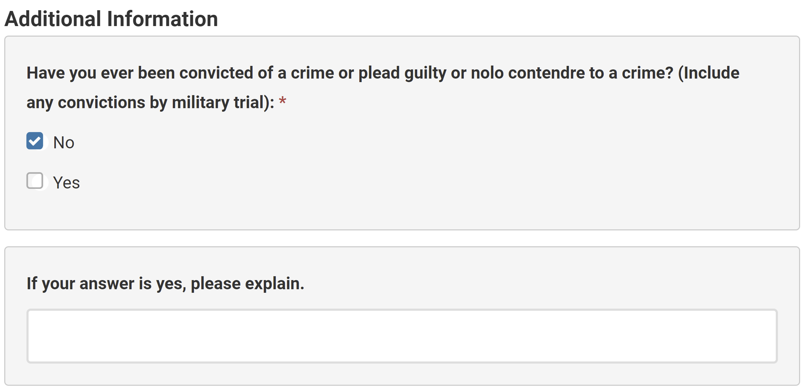

```{r Setup, include = F}
options(htmltools.dir.version = FALSE)
library(pacman)
p_load(ggthemes, readxl, viridis, knitr, ggdag, gapminder, extrafont, tidyverse, magrittr, janitor, kableExtra)
# Define colors
red_pink <- "#e64173"
met_slate <- "#272822" # metropolis font color 
purple <- "#9370DB"
green <- "#007935"
light_green <- "#7DBA97"
orange <- "#FD5F00"
turquoise <- "#44C1C4"
# Knitr options
opts_chunk$set(
  comment = "#>",
  fig.align = "center",
  fig.height = 7,
  fig.width = 10.5,
  #dpi = 300,
  #cache = T,
  warning = F,
  message = F
)  
theme_simple <- theme_bw() + theme(
  axis.line = element_line(color = met_slate),
  panel.grid = element_blank(),
  rect = element_blank(),
  # strip.text = element_blank(),
  text = element_text(family = "Fira Sans", color = met_slate, size = 17),
  axis.text.x = element_text(size = 12),
  axis.text.y = element_text(size = 12),
  axis.ticks = element_blank()
)
theme_market <- theme_bw() + theme(
  axis.line = element_line(color = met_slate),
  panel.grid = element_blank(),
  rect = element_blank(),
  strip.text = element_blank(),
  text = element_text(family = "Fira Sans", color = met_slate, size = 17),
  axis.title.x = element_text(hjust = 1, size = 17),
  axis.title.y = element_text(hjust = 1, angle = 0, size = 17),
  # axis.text.x = element_text(size = 12),
  # axis.text.y = element_text(size = 12),
  axis.ticks = element_blank()
)
theme_gif <- theme_bw() + theme(
  axis.line = element_line(color = met_slate),
  panel.grid = element_blank(),
  rect = element_blank(),
  text = element_text(family = "Fira Sans", color = met_slate, size = 17),
  axis.text.x = element_text(size = 12),
  axis.text.y = element_text(size = 12),
  axis.ticks = element_blank()
)

xaringanExtra::use_scribble()
```

# Bertrand and Mullainathan (2004)

## **Discussion**

**Q.sub[1]:** How does the study measure discrimination in the labor market? 

**Q.sub[2]:** What are the strengths of the research design?

**Q.sub[3]:** What are the weaknesses of the research design?

**Q.sub[4]:** What are the main findings? 

**Q.sub[5]:** What does the study tell us about employers?

**Q.sub[6]:** What did *you* find most interesting and/or depressing?

---
# Discrimination

## **Theory**

Economics has a lot to say about discrimination in the labor market and other settings..super[.hi-pink[<span>1</span>]]

While they do not explain all forms of discrimination,.super[.hi-pink[<span>2</span>]] the two most prominent economic models of discrimination are

1. **Taste-based discrimination:** Prejudiced employers willingly sacrifice resources to avoid contact with workers from certain groups.

2. **Statistical discrimination:** Unprejudiced employers use group characteristics to make inferences about an individual worker's productivity.


.footnote[.super[.hi-pink[<span>1</span>]] Kevin Lang and Ariella Kahn-Lang Spitzer (2020), [Race Discrimination: An Economic Perspective](https://pubs.aeaweb.org/doi/pdf/10.1257/jep.34.2.68), *Journal of Economic Perspectives*. <br> .super[.hi-pink[<span>2</span>]] Mario L. Small and Devah Pager (2020), [Sociological Perspectives on Racial Discrimination](https://pubs.aeaweb.org/doi/pdfplus/10.1257/jep.34.2.49), *Journal of Economic Perspectives*]


---
# Taste-based discrimination

Models of **taste-based discrimination**.super[.hi-pink[<span>&#8224;</span>]] posit that **prejudice** (or **animus**) causes discrimination in the labor market. 
- **The premise?** Some economic agents would **willingly sacrifice resources to avoid contact** with certain groups of people. 

.footnote[.super[.hi-pink[<span>&#8224;</span>]] Developed by Gary Becker in [The Economics of Discrimination](https://alliance-primo.hosted.exlibrisgroup.com/permalink/f/to8ro2/CP71244526180001451), *University of Chicago Press* (1957).]

--

### **Setup** 

Two groups of equally productive workers: 
1. **In-group** workers (*e.g.,* White workers) who receive the wage $w_\text{W}$.
2. **Out-group** workers (*e.g.,* Black workers) who receive the wage $w_\text{B}$.

---
# Taste-based discrimination

Models of **taste-based discrimination**.super[.hi-pink[<span>&#8224;</span>]] posit that **prejudice** (or **animus**) causes discrimination in the labor market. 
- **The premise?** Some economic agents would **willingly sacrifice resources to avoid contact** with certain groups of people. 

.footnote[.super[.hi-pink[<span>&#8224;</span>]] Developed by Gary Becker in [The Economics of Discrimination](https://alliance-primo.hosted.exlibrisgroup.com/permalink/f/to8ro2/CP71244526180001451), *University of Chicago Press* (1957).]

### **Setup** 

A **discrimination coefficient** $d$ captures the **disutility of out-group contact** for three types of prejudiced economic agents:
1. **Employers** who perceive hiring out-group workers as $d \times 100$-percent more costly than $w_\text{B}$.
2. **Co-workers** who perceive their wage as $d \times 100$-percent lower when working with the out-group.
3. **Customers** who perceive prices as $d \times 100$-percent when buying from an out-group seller.

---
# Taste-based discrimination

## **Employer discrimination**

Since both groups of workers are **equally productive**, they are **perfect substitutes**.

- The level of output simply depends on the number of workers: $q = f(E_\text{W} + E_\text{B})$.
- A firm with 25 in-group workers and 25 out-groups **produces the same output** as a firm with 50 in-group workers or a firm with 50 out-group workers.
- $\text{MP}_E$ does not depend on in-group/out-group status!


--

**Q:** How would a non-discriminatory employer maximize profit?

--

- **A:** By hiring from the cheaper group of workers until $w = \text{VMP}_E$.
    - If $w_\text{W} > w_\text{B}$, then hire $E^*_\text{B}$ out-group workers such that $w_\text{B} = \text{VMP}_E$.
    - If $w_\text{B} > w_\text{W}$, then hire $E^*_\text{W}$ in-group workers such that $w_\text{W} = \text{VMP}_E$.


--

Going forward, we will assume that $w_\text{W} > w_\text{B}$.

---
# Taste-based discrimination

.pull-left[
```{r, echo = FALSE, fig.height = 5.5, fig.width = 5.5, dev = "svg"}
x <- 0:20
vmp <- function(x) 1 - 1/20 * x
wage_b <- 0.25
wage_w <- 0.75
optimal_e <- uniroot(function(x) vmp(x) - wage_b, range(x))$root


plot <- ggplot() +
  stat_function(
    data = tibble(x = 0:20),
    xlim = c(1, 20),
    fun = vmp,
    aes(x = x),
    color = purple,
    size = 1,
  ) +
  annotate("label", label = expression(VMP[E]), x = 18, y = vmp(18), color = purple, family = "Fira Sans", size = 5) +
  geom_hline(yintercept = wage_w, color = met_slate, size = 1) +
  geom_hline(yintercept = wage_b, color = met_slate, size = 1) +
  geom_point(aes(x = optimal_e, y = wage_b), color = met_slate, size = 2) +
  geom_segment(aes(x = optimal_e, y = 0, xend = optimal_e, yend = wage_b), linetype  = "dashed", color = met_slate) + 
  scale_x_continuous(limits = c(0, 21), expand = c(0, 0), breaks = c(optimal_e), labels = c(expression(E[B]^"*"))) +
  scale_y_continuous(limits = c(0, 1.05), expand = c(0, 0), breaks = c(wage_b, wage_w), labels = c(expression(w[B]), expression(w[W]))) +
  labs(x = "Employment", y = "Wage") +
  theme_simple +
  theme(axis.title.x = element_text(margin = margin(t = 10)),
        axis.title.y = element_text(margin = margin(r = 10)))

plot
```
]
.pull-right[
## **Employer discrimination**

Non-discriminatory employers simply **hire out-group workers**.

- **Why?** Both groups of workers are equally productive (*i.e.,* same $\text{VMP}_E$), but out-group labor is cheaper (*i.e.,* $w_\text{B} < w_\text{W}$).

]

---
# Taste-based discrimination

## **Employer discrimination**

Discriminatory employers perceive the cost of employing an out-group worker as $w_\text{B}(1 + d)$.

- If $w_\text{B}=10$ and $d=0.1$, then the employer will act as though the out-group worker costs $10(1 + 0.1) = 11$.
- The "utility-adjusted" cost of hiring an out-group worker exceeds the actual cost!

--

**The result?** Segregation! A discriminatory employer will

- Hire only in-group workers if $w_\text{B}(1 + d) > w_\text{W}$
- Hire only out-group workers if $w_\text{B}(1 + d) < w_\text{W}$

---
# Taste-based discrimination

.pull-left[
```{r, echo = FALSE, fig.height = 5.5, fig.width = 5.5, dev = "svg"}
x <- 0:20
vmp <- function(x) 1 - 1/20 * x
wage <- 0.75
optimal_e <- uniroot(function(x) vmp(x) - wage, range(x))$root

plot <- ggplot() +
  stat_function(
    data = tibble(x = 0:20),
    xlim = c(1, 20),
    fun = vmp,
    aes(x = x),
    color = purple,
    size = 1,
  ) +
  annotate("label", label = expression(VMP[E]), x = 18, y = vmp(18), color = purple, family = "Fira Sans", size = 5) +
  geom_hline(yintercept = wage, color = met_slate, size = 1) +
  geom_point(aes(x = optimal_e, y = wage), color = met_slate, size = 2) +
  geom_segment(aes(x = optimal_e, y = 0, xend = optimal_e, yend = wage), linetype  = "dashed", color = met_slate) + 
  scale_x_continuous(limits = c(0, 21), expand = c(0, 0), breaks = c(optimal_e), labels = c(expression(E[W]^"*"))) +
  scale_y_continuous(limits = c(0, 1.05), expand = c(0, 0), breaks = c(wage), labels = c(expression(w[W]))) +
  labs(x = "Employment", y = "Wage") +
  theme_simple +
  theme(axis.title.x = element_text(margin = margin(t = 10)),
        axis.title.y = element_text(margin = margin(r = 10)))

plot
```
]
.pull-right[
## **Employer discrimination**

**Case 1:** Employer hires only in-group workers.

- The employer **overpays for labor!**
    - $w_\text{W} > w_\text{B}$, but $\text{VMP}_E$ is the same for both groups of workers.
- Because in-group labor is relatively expensive, the employer **hires too few workers!**.
]

---
# Taste-based discrimination

.pull-left[
```{r, echo = FALSE, fig.height = 5.5, fig.width = 5.5, dev = "svg"}
x <- 0:20
vmp <- function(x) 1 - 1/20 * x
wage <- 0.25
discrim <- 1
optimal_e <- uniroot(function(x) vmp(x) - wage, range(x))$root
actual_e <- uniroot(function(x) vmp(x) - wage * (1 + discrim), range(x))$root


plot <- ggplot() +
  stat_function(
    data = tibble(x = 0:20),
    xlim = c(1, 20),
    fun = vmp,
    aes(x = x),
    color = purple,
    size = 1,
  ) +
  annotate("label", label = expression(VMP[E]), x = 18, y = vmp(18), color = purple, family = "Fira Sans", size = 5) +
  geom_hline(yintercept = wage, color = met_slate, size = 1) +
  geom_hline(yintercept = wage * (1 + discrim), color = met_slate, size = 1) +
  geom_point(aes(x = optimal_e, y = wage), color = met_slate, size = 2) +
  geom_segment(aes(x = optimal_e, y = 0, xend = optimal_e, yend = wage), linetype  = "dashed", color = met_slate) + 
  
  geom_point(aes(x = actual_e, y = wage * (1 + discrim)), color = met_slate, size = 2) +
  geom_segment(aes(x = actual_e, y = 0, xend = actual_e, yend =  wage * (1 + discrim)), linetype  = "dashed", color = met_slate) + 
  
  scale_x_continuous(limits = c(0, 21), expand = c(0, 0), breaks = c(actual_e, optimal_e), labels = c(expression(E[B]^"*"), expression(E[B]))) +
  scale_y_continuous(limits = c(0, 1.05), expand = c(0, 0), breaks = c(wage, wage * (1 + discrim)), labels = c(expression(w[B]), expression(w[B](1+d)))) +
  labs(x = "Employment", y = "Wage") +
  theme_simple +
  theme(axis.title.x = element_text(margin = margin(t = 10)),
        axis.title.y = element_text(margin = margin(r = 10)))

plot
```
]
.pull-right[
## **Employer discrimination**

**Case 2:** Employer hires only out-group workers.

- The employer **hires too few workers!** 
    - Actual hiring $E^*_\text{B}$ occurs where $w_\text{B}(1+d)= \text{VMP}_E$, even though the actual wage is $w_\text{B}$.
- The employer **pays the out-group worker too little!**
    - The marginal worker receives less than her contribution, as $w_\text{B} < \text{VMP}_E = w_\text{B}(1+d)$.
]

---
# Taste-based discrimination

## **Employer discrimination**

**Q:** Is discrimination profitable?

--

**A:** No! 

- To indulge their distaste for out-group workers, **prejudiced employers sacrifice profit!**
- By hiring too few workers, discriminatory employers fail to operate efficiently!


--

**The implication?** In a perfectly competitive market, non-discriminating employers will eventually drive discriminating employers out of business.

- In-group and out-group wages will eventually equalize.


--

**Q.sub[1]:** Are wage differentials actually decreasing? <br> **Q.sub[2]:** Are markets actually perfectly competitive?

---
# Taste-based discrimination

## **Co-worker discrimination**

Suppose instead that employers are unprejudiced, but in-group workers dislike working with out-group workers.

- In-group workers receive $w_\text{W}$, but act as though they're paid $w_\text{W}(1-d)$.


--

To offset the disutility of working with out-group workers, the employer would have to pay in-group workers an additional $w_\text{W} \times d$ dollars.

- The total wage paid for an in-group worker would rise to $w_\text{W}(1+d)$.
- If the marginal productivity of in-group and out-group workers is the same, and there are no discriminatory employers, then $w_\text{W} = w_\text{B} < w_\text{W}(1+d)$.

**The result?** Segregation that persists *even with perfect competition*, but no wage differential.


---
# Taste-based discrimination

## **Customer discrimination**

Now suppose that workers and employers are unprejudiced, but customers dislike buying from the out-group.

- A prejudiced customer faces the actual market price $p$, but feels as though they are paying $p(1+d)$.


--

An employer with out-group workers would have to reduce $p$ to compensate prejudiced customers.

- This assumes that the employer is unable to reallocate out-group workers away from customer-facing roles within the firm.


--

**The result?** The employer decreases wages for out-group workers, creating a wage differential that persists *even with perfect competition*.

---
# Statistical discrimination

Models of **statistical discrimination**.super[.hi-pink[<span>&#8224;</span>]] posit that discrimination arises from employer **uncertainty** about difficult-to-observe productive attributes of workers. 

.footnote[.super[.hi-pink[<span>&#8224;</span>]] Developed by Edmund Phelps in [The Statistical Theory of Racism and Sexism](https://www.jstor.org/stable/1806107), *The American Economic Review* (1972), and Kenneth Arrow in "The Theory of Discrimination" in Orley Ashenfelter and Albert Rees, eds., [Discrimination in Labor Markets](https://alliance-primo.hosted.exlibrisgroup.com/permalink/f/to8ro2/CP71344164760001451), *Princeton University Press* (1973).]

**The premise?** Employers use a worker's race or gender to make inferences about the worker's productivity.

--

- In these models, **employers are unprejudiced**&mdash;they do not have a taste for discrimination.
- **The basis for discrimination?** Group differences in past performance (*e.g.,* achievement gaps).
    - When considering job applicants with the same observable productive traits, but different group characteristics (*e.g.,* race), employers will often rely on the **past performance of groups** to predict **difficult-to-observe productive traits of individuals**. 
    - Discrimination occurs when the employer systematically favors applicants from higher-productivity groups.

---
# Statistical discrimination

Employers can test workers for productive traits, but it is unlikely that a test can perfectly predict productivity.

To set a worker's wage, an employer uses a weighted average of the worker's test score and the average score of the group to which the worker belongs: $$w = \alpha T + (1-\alpha)\overline{T}$$

--

- $T$ is the individual's test score.
- $\overline{T}$ is the group average.
- $0 \leq \alpha \leq 1$ represents how well the test measures productivity.
    - If $\alpha = 1$, then the test provides a perfect measure of individual productivity and $w=T$.
    - If $\alpha = 0$, then the test provides no meaningful measure of individual productivity and $w=\overline{T}$.

---
class: inverse, middle

# Ban the box

---
class: clear-slide

```{r, echo = F, out.width = "95%"}

```

--

**Q:** Why do employers ask about criminal history?

---
# Ban the box

.more-left[
.center[**States with ban-the-box laws (2021)**]
```{R, echo = FALSE, fig.height = 7, dev = "svg"}
p_load(sf, ggthemes, albersusa)

state_df <- map_data("state")

us_sf <- usa_sf("laea") %>% 
  mutate(laws = case_when(
    name %in% c(
      "California",
      "Colorado",
      "Connecticut",
      "District of Columbia",
      "Hawaii", 
      "Illinois",
      "Maine",
      "Maryland",
      "Massachusetts",
      "Minnesota",
      "New Jersey",
      "New Mexico",
      "Oregon",
      "Rhode Island",
      "Vermont",
      "Washington"
    ) ~ "All employers",
    name %in% c(
      "Arizona",
      "Delaware",
      "Georgia",
      "Indiana",
      "Kansas",
      "Kentucky",
      "Louisiana",
      "Michigan",
      "Missouri",
      "Nebraska",
      "Nevada",
      "New Hampshire",
      "New York",
      "North Carolina",
      "North Dakota",
      "Ohio",
      "Oklahoma",
      "Pennsylvania",
      "Tennessee",
      "Utah",
      "Virginia",
      "Wisconsin"
    ) ~ "Public employers",
    TRUE ~ "No ban-the-box law"
  ),
  laws = fct_relevel(as.factor(laws), "All employers", "Public employers", "No ban-the-box law"))
ggplot() +
  geom_sf(data = us_sf, size = 0.5, color = "white", aes(fill = laws)) +
  scale_fill_manual(values = c(green, light_green, "grey80")) + 
  labs(fill = "Coverage") +
  # remove clutter
  theme_map() + theme(text = element_text(family = "Fira Sans", size = 20, color = met_slate),
                      legend.position = c(0.55, 0.05))

```
.footnote[*Source:* National Employment Law Project]
]
.less-right[
**The policy?** Forbid employers from asking about criminal history on job applications.


**The objective?** Expand employment opportunities for people with criminal records and **reduce racial disparities** in hiring.

<!-- **The (intended) mechanism?** Removing the box allows applicants with prior convictions to get their foot in the door, increasing the odds of employment. -->
]
    
---
# Ban the box

**Q:** How might an employer respond to a ban-the-box law? 

--

- Take a chance on candidates with criminal records?
- Avoid candidates who are more likely to have a prior conviction? 

--

**Intended consequence:** Applicants with prior convictions get their foot in the door, increasing their odds of getting hired.

- Other things being equal, this would increase the probability of employment for young men of color.


--

**Unintended consequence:** Employers could respond by using race as a proxy for criminal history.

- Other things being equal, this would decrease the probability of employment for young men of color *without criminal records*.
--

- **Statistical discrimination!**

---
# Agan and Starr (2017)

## **Discussion**

**Q.sub[1]:** What is the research question? 

**Q.sub[2]:** How does the study address the research question?

**Q.sub[3]:** What are the main findings?

**Q.sub[4]:** How does the study advance our understanding of racial discrimination in the labor market?

**Q.sub[5]:** What are the policy implications?

**Q.sub[6]:** What did *you* find most interesting?


---
# Housekeeping

**Problem Set 4** is due by **Friday, March 11th at 11:59pm**.

**Final Exam** is scheduled for **Tuesday, March 15th at 2:45pm**.

- In-person!